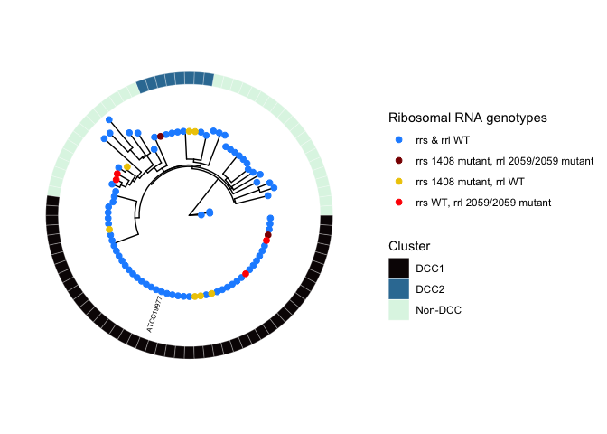
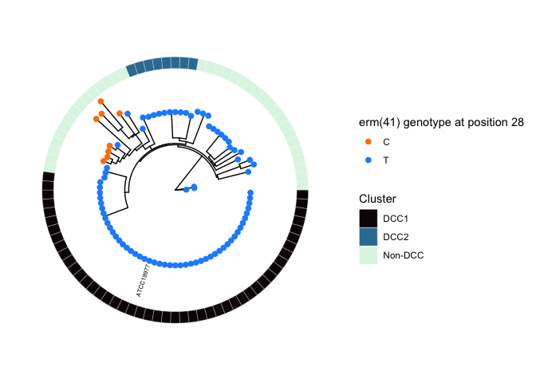

Analysis of Antimicrobial Resistance Mutations In M. abscessus
================
Vinicius Calado
2023-04-07

## Libraries

``` r
library(tidyverse)
library(readxl)
library(epiR)
library(ggtree)
```

## 1) Sensitivity and Specificity Calculations

``` r
rrs_matrix <- read.csv('rrs_confusion_matrix.csv')
epi.tests(as.matrix(rrs_matrix[2:3]))
```

    ##           Outcome +    Outcome -      Total
    ## Test +           27            0         27
    ## Test -            0          188        188
    ## Total            27          188        215
    ## 
    ## Point estimates and 95% CIs:
    ## --------------------------------------------------------------
    ## Apparent prevalence *                  0.13 (0.08, 0.18)
    ## True prevalence *                      0.13 (0.08, 0.18)
    ## Sensitivity *                          1.00 (0.87, 1.00)
    ## Specificity *                          1.00 (0.98, 1.00)
    ## Positive predictive value *            1.00 (0.87, 1.00)
    ## Negative predictive value *            1.00 (0.98, 1.00)
    ## Positive likelihood ratio              Inf (NaN, Inf)
    ## Negative likelihood ratio              0.00 (0.00, NaN)
    ## False T+ proportion for true D- *      0.00 (0.00, 0.02)
    ## False T- proportion for true D+ *      0.00 (0.00, 0.13)
    ## False T+ proportion for T+ *           0.00 (0.00, 0.13)
    ## False T- proportion for T- *           0.00 (0.00, 0.02)
    ## Correctly classified proportion *      1.00 (0.98, 1.00)
    ## --------------------------------------------------------------
    ## * Exact CIs

``` r
rrl_matrix <- read.csv('rrl_confusion_matrix.csv')
epi.tests(as.matrix(rrl_matrix[2:3]))
```

    ##           Outcome +    Outcome -      Total
    ## Test +           11            0         11
    ## Test -            5          190        195
    ## Total            16          190        206
    ## 
    ## Point estimates and 95% CIs:
    ## --------------------------------------------------------------
    ## Apparent prevalence *                  0.05 (0.03, 0.09)
    ## True prevalence *                      0.08 (0.05, 0.12)
    ## Sensitivity *                          0.69 (0.41, 0.89)
    ## Specificity *                          1.00 (0.98, 1.00)
    ## Positive predictive value *            1.00 (0.72, 1.00)
    ## Negative predictive value *            0.97 (0.94, 0.99)
    ## Positive likelihood ratio              Inf (NaN, Inf)
    ## Negative likelihood ratio              0.31 (0.15, 0.65)
    ## False T+ proportion for true D- *      0.00 (0.00, 0.02)
    ## False T- proportion for true D+ *      0.31 (0.11, 0.59)
    ## False T+ proportion for T+ *           0.00 (0.00, 0.28)
    ## False T- proportion for T- *           0.03 (0.01, 0.06)
    ## Correctly classified proportion *      0.98 (0.94, 0.99)
    ## --------------------------------------------------------------
    ## * Exact CIs

``` r
erm_matrix = read.csv('erm_confusion_matrix.csv')
epi.tests(as.matrix(erm_matrix[2:3]))
```

    ##           Outcome +    Outcome -      Total
    ## Test +           28            0         28
    ## Test -            0           12         12
    ## Total            28           12         40
    ## 
    ## Point estimates and 95% CIs:
    ## --------------------------------------------------------------
    ## Apparent prevalence *                  0.70 (0.53, 0.83)
    ## True prevalence *                      0.70 (0.53, 0.83)
    ## Sensitivity *                          1.00 (0.88, 1.00)
    ## Specificity *                          1.00 (0.74, 1.00)
    ## Positive predictive value *            1.00 (0.88, 1.00)
    ## Negative predictive value *            1.00 (0.74, 1.00)
    ## Positive likelihood ratio              Inf (NaN, Inf)
    ## Negative likelihood ratio              0.00 (0.00, NaN)
    ## False T+ proportion for true D- *      0.00 (0.00, 0.26)
    ## False T- proportion for true D+ *      0.00 (0.00, 0.12)
    ## False T+ proportion for T+ *           0.00 (0.00, 0.12)
    ## False T- proportion for T- *           0.00 (0.00, 0.26)
    ## Correctly classified proportion *      1.00 (0.91, 1.00)
    ## --------------------------------------------------------------
    ## * Exact CIs

## 2) Phylogenetic Tree

``` r
# Loading datasets 
meta_data <- read_excel('MAB_dataset_clean.xlsx')
mab_atcc <- read_csv('MAB_ATCC.csv')
meta_data <- meta_data %>%  select(Isolate, Patient_ASID,
                                   rrs_prediction, rrl_prediction, 
                                   erm41_28, erm_prediction,
                                   WGS_Identification, Clone)
meta_data <- meta_data %>% filter(!duplicated(Patient_ASID) & 
                                    WGS_Identification == 'MAB')
meta_data <- meta_data %>% full_join(mab_atcc, by='Isolate')
glimpse(meta_data)
```

    ## Rows: 90
    ## Columns: 9
    ## $ Isolate            <chr> "CF00006-00020.MAB", "CF00013-00035.MAB", "CF00026-…
    ## $ Patient_ASID       <chr> "CF00006", "CF00013", "CF00026", "CF00017", "CF0001…
    ## $ rrs_prediction     <chr> "Not resistant", "Not resistant", "Not resistant", …
    ## $ rrl_prediction     <chr> "Not resistant", "Not resistant", "Not resistant", …
    ## $ erm41_28           <chr> "T", "C", "T", "T", "T", "T", "T", "T", "T", "T", "…
    ## $ erm_prediction     <chr> "Resistant", "Not resistant", "Resistant", "Resista…
    ## $ WGS_Identification <chr> "MAB", "MAB", "MAB", "MAB", "MAB", "MAB", "MAB", "M…
    ## $ Clone              <chr> "MAB.clone001", "MAB.clone010", "MAB.clone001", "MA…
    ## $ Label              <chr> NA, NA, NA, NA, NA, NA, NA, NA, NA, NA, NA, NA, NA,…

### Data wrangling

``` r
# Classifying dominant clones
meta_data <- meta_data %>% filter(!duplicated(Patient_ASID))
meta_data <- meta_data %>% mutate(Clone = case_when(
  Clone == 'MAB.clone001' ~ 'DCC1', 
  Clone == 'MAB.clone002' ~ 'DCC2', 
  TRUE ~ 'Non-DCC'
))

# Changing lables for the tree
meta_data <- meta_data %>% rename(rrs = rrs_prediction, 
                                  rrl = rrl_prediction)
meta_data <- meta_data %>% mutate(Clone=case_when(
  Label == 'ATCC19977' ~ 'DCC1',
  TRUE ~ Clone
))
meta_data <-meta_data %>% mutate(erm41_28 = case_when(
  Label == 'ATCC19977' ~ 'T',
  TRUE ~ erm41_28
))
meta_data <- meta_data %>% mutate(Genotype = case_when(
  rrs == 'Not resistant' &
    rrl == 'Not resistant' ~ 'rrs WT, rrl WT',
  Label == 'ATCC19977' ~ 'rrs WT, rrl WT',
  rrs == 'Resistant' & rrl == 'Not resistant' ~'rrs mutation, rrl WT',
  rrs == 'Not resistant' & rrl == 'Resistant' ~ 'rrs WT, rrl mutation', 
  rrs == 'Resistant' & rrl == 'Resistant' ~ 'rrs mutation, rrl mutation'
))
glimpse(meta_data)
```

    ## Rows: 90
    ## Columns: 10
    ## $ Isolate            <chr> "CF00006-00020.MAB", "CF00013-00035.MAB", "CF00026-…
    ## $ Patient_ASID       <chr> "CF00006", "CF00013", "CF00026", "CF00017", "CF0001…
    ## $ rrs                <chr> "Not resistant", "Not resistant", "Not resistant", …
    ## $ rrl                <chr> "Not resistant", "Not resistant", "Not resistant", …
    ## $ erm41_28           <chr> "T", "C", "T", "T", "T", "T", "T", "T", "T", "T", "…
    ## $ erm_prediction     <chr> "Resistant", "Not resistant", "Resistant", "Resista…
    ## $ WGS_Identification <chr> "MAB", "MAB", "MAB", "MAB", "MAB", "MAB", "MAB", "M…
    ## $ Clone              <chr> "DCC1", "Non-DCC", "DCC1", "DCC2", "Non-DCC", "DCC1…
    ## $ Label              <chr> NA, NA, NA, NA, NA, NA, NA, NA, NA, NA, NA, NA, NA,…
    ## $ Genotype           <chr> "rrs WT, rrl WT", "rrs WT, rrl WT", "rrs WT, rrl WT…

### Visualization of the tree

``` r
# Tree object
tree <- read.tree('nj250.89_MAB_isolates_add_ref.snpsites_UNROOT.nwk')

# Joining metadata with tree
tree_meta <- ggtree(tree, layout = 'circular') %<+% meta_data

# Dataframe with clone classifications
clones <- as.data.frame(meta_data %>% select(Clone))
rownames(clones) <- meta_data$Isolate
head(clones)
```

    ##                     Clone
    ## CF00006-00020.MAB    DCC1
    ## CF00013-00035.MAB Non-DCC
    ## CF00026-00061.MAB    DCC1
    ## CF00017-00040.MAB    DCC2
    ## CF00016-00037.MAB Non-DCC
    ## CF00165-00215.MAB    DCC1

#### Ribosomal RNA

``` r
labeled_tree <- tree_meta +
  geom_tippoint(aes(color = Genotype), size = 4) +
  scale_color_manual(values=c('rrs WT, rrl WT' = 'dodgerblue',
                              'rrs mutation, rrl WT' = 'gold2', 
                              'rrs WT, rrl mutation' = 'red', 
                              'rrs mutation, rrl mutation' = 'darkred'),
                     name='Ribosomal RNA')  +
  geom_tiplab(aes(label=Label), size = 4, hjust = -0.1)

gheatmap(labeled_tree, data = clones, 
         colnames = F,
         offset = 20, width=.1) + 
  scale_fill_viridis_d(option = 'G', name='Cluster')
```

    ## Scale for 'y' is already present. Adding another scale for 'y', which will
    ## replace the existing scale.

    ## Scale for 'fill' is already present. Adding another scale for 'fill', which
    ## will replace the existing scale.

<!-- -->

#### erm(41) position 28

``` r
labeled_tree <- tree_meta +
  geom_tippoint(aes(color = erm41_28), size = 4) +
  scale_color_manual(values=c('C' = 'darkorange1', 'T' = 'dodgerblue'), 
                     name='erm(41)') +
  geom_tiplab(aes(label=Label), size = 4, hjust = -0.1) 

gheatmap(labeled_tree, data = clones, 
         colnames = F,
         offset = 20, width=.1) + 
  scale_fill_viridis_d(option = 'G', name='Cluster')
```

    ## Scale for 'y' is already present. Adding another scale for 'y', which will
    ## replace the existing scale.

    ## Scale for 'fill' is already present. Adding another scale for 'fill', which
    ## will replace the existing scale.

<!-- -->

## 3.1) DR genotypes across different dominant clones and subspecies

### Loading datasets

``` r
df <- read_excel('MAB_dataset_clean.xlsx')
```

    ## New names:
    ## • `` -> `...1`

``` r
df <- df %>% select(Isolate, Patient_ASID, WGS_Identification, 
                    rrs_prediction, rrl_prediction, 
                    erm41_28, Clone) %>% filter(!(duplicated(Patient_ASID)))
df <- df %>% mutate(dominant_clone = case_when(
  Clone == 'MAB.clone001' | Clone == 'MAB.clone002' ~ 'DCC', 
  TRUE ~ 'Non-DCC'))
df <- df %>% mutate(ribosomal_RNA_mutation = case_when(
  rrs_prediction == 'Resistant' | rrl_prediction == 'Resistant' ~ 'Yes', 
  TRUE ~ 'No'))
glimpse(df)
```

    ## Rows: 115
    ## Columns: 9
    ## $ Isolate                <chr> "CF00001-00009.MMAS", "CF00006-00020.MAB", "CF0…
    ## $ Patient_ASID           <chr> "CF00001", "CF00006", "CF00008", "CF00013", "CF…
    ## $ WGS_Identification     <chr> "MMAS", "MAB", "MMAS", "MAB", "MAB", "MAB", "MA…
    ## $ rrs_prediction         <chr> "Not resistant", "Not resistant", "Not resistan…
    ## $ rrl_prediction         <chr> "Not resistant", "Not resistant", "Not resistan…
    ## $ erm41_28               <chr> "truncated", "T", "truncated", "C", "T", "T", "…
    ## $ Clone                  <chr> "MMAS.other", "MAB.clone001", "MMAS.clone006", …
    ## $ dominant_clone         <chr> "Non-DCC", "DCC", "Non-DCC", "Non-DCC", "DCC", …
    ## $ ribosomal_RNA_mutation <chr> "No", "No", "No", "No", "No", "Yes", "No", "Yes…

``` r
# Only M. abscessus susbsp. abscessus
mab <- df %>% filter(WGS_Identification == 'MAB')
glimpse(mab)
```

    ## Rows: 89
    ## Columns: 9
    ## $ Isolate                <chr> "CF00006-00020.MAB", "CF00013-00035.MAB", "CF00…
    ## $ Patient_ASID           <chr> "CF00006", "CF00013", "CF00026", "CF00017", "CF…
    ## $ WGS_Identification     <chr> "MAB", "MAB", "MAB", "MAB", "MAB", "MAB", "MAB"…
    ## $ rrs_prediction         <chr> "Not resistant", "Not resistant", "Not resistan…
    ## $ rrl_prediction         <chr> "Not resistant", "Not resistant", "Not resistan…
    ## $ erm41_28               <chr> "T", "C", "T", "T", "T", "T", "T", "T", "T", "T…
    ## $ Clone                  <chr> "MAB.clone001", "MAB.clone010", "MAB.clone001",…
    ## $ dominant_clone         <chr> "DCC", "Non-DCC", "DCC", "DCC", "Non-DCC", "DCC…
    ## $ ribosomal_RNA_mutation <chr> "No", "No", "No", "Yes", "No", "Yes", "No", "No…

### 3.1) Dominant clones

#### rrs

``` r
dcc_rrs <- mab %>% 
  group_by(dominant_clone, rrs_prediction) %>% count() %>% ungroup()
dcc_rrs <- dcc_rrs %>%
  pivot_wider(names_from = rrs_prediction,
              values_from = n)
dcc_rrs
```

    ## # A tibble: 2 × 3
    ##   dominant_clone `Not resistant` Resistant
    ##   <chr>                    <int>     <int>
    ## 1 DCC                         46         8
    ## 2 Non-DCC                     34         1

``` r
fisher.test(dcc_rrs[2:3])
```

    ## 
    ##  Fisher's Exact Test for Count Data
    ## 
    ## data:  dcc_rrs[2:3]
    ## p-value = 0.08291
    ## alternative hypothesis: true odds ratio is not equal to 1
    ## 95 percent confidence interval:
    ##  0.003709094 1.383866242
    ## sample estimates:
    ## odds ratio 
    ##  0.1717231

#### rrl

``` r
dcc_rrl <- mab %>% 
  group_by(dominant_clone, rrl_prediction) %>% count() %>% ungroup()
dcc_rrl <- dcc_rrl %>%
  pivot_wider(names_from = rrl_prediction,
              values_from = n)
dcc_rrl
```

    ## # A tibble: 2 × 3
    ##   dominant_clone `Not resistant` Resistant
    ##   <chr>                    <int>     <int>
    ## 1 DCC                         50         4
    ## 2 Non-DCC                     33         2

``` r
fisher.test(dcc_rrl[2:3])
```

    ## 
    ##  Fisher's Exact Test for Count Data
    ## 
    ## data:  dcc_rrl[2:3]
    ## p-value = 1
    ## alternative hypothesis: true odds ratio is not equal to 1
    ## 95 percent confidence interval:
    ##  0.06521129 5.65258644
    ## sample estimates:
    ## odds ratio 
    ##  0.7598735

#### rrs and rrl

``` r
dcc_rrna <- mab %>% 
  group_by(dominant_clone, ribosomal_RNA_mutation) %>% count() %>% ungroup()
dcc_rrna <- dcc_rrna %>%
  pivot_wider(names_from = ribosomal_RNA_mutation,
              values_from = n)
dcc_rrna
```

    ## # A tibble: 2 × 3
    ##   dominant_clone    No   Yes
    ##   <chr>          <int> <int>
    ## 1 DCC               44    10
    ## 2 Non-DCC           32     3

``` r
fisher.test(dcc_rrna[2:3])
```

    ## 
    ##  Fisher's Exact Test for Count Data
    ## 
    ## data:  dcc_rrna[2:3]
    ## p-value = 0.2337
    ## alternative hypothesis: true odds ratio is not equal to 1
    ## 95 percent confidence interval:
    ##  0.0681814 1.7928516
    ## sample estimates:
    ## odds ratio 
    ##  0.4162962

#### erm41

``` r
dcc_erm <- mab %>% 
  group_by(dominant_clone, erm41_28) %>% count() %>% ungroup()
dcc_erm <- dcc_erm %>% 
  pivot_wider(names_from = erm41_28,
              values_from = n)
dcc_erm <- dcc_erm %>% replace(is.na(dcc_erm), 0)
dcc_erm
```

    ## # A tibble: 2 × 3
    ##   dominant_clone     T     C
    ##   <chr>          <int> <int>
    ## 1 DCC               54     0
    ## 2 Non-DCC           27     8

``` r
fisher.test(dcc_erm[2:3])
```

    ## 
    ##  Fisher's Exact Test for Count Data
    ## 
    ## data:  dcc_erm[2:3]
    ## p-value = 0.0003332
    ## alternative hypothesis: true odds ratio is not equal to 1
    ## 95 percent confidence interval:
    ##  3.079547      Inf
    ## sample estimates:
    ## odds ratio 
    ##        Inf

### 3.2) Subspecies

#### rrs

``` r
subsp_rrs <- df %>% 
  group_by(WGS_Identification, rrs_prediction) %>% count() %>% ungroup()
subsp_rrs <- subsp_rrs %>% 
  pivot_wider(names_from = rrs_prediction,
              values_from = n)
subsp_rrs <- subsp_rrs %>% replace(is.na(subsp_rrs), 0)
subsp_rrs
```

    ## # A tibble: 3 × 3
    ##   WGS_Identification `Not resistant` Resistant
    ##   <chr>                        <int>     <int>
    ## 1 MAB                             80         9
    ## 2 MBOL                             2         1
    ## 3 MMAS                            23         0

``` r
fisher.test(subsp_rrs[2:3])
```

    ## 
    ##  Fisher's Exact Test for Count Data
    ## 
    ## data:  subsp_rrs[2:3]
    ## p-value = 0.08625
    ## alternative hypothesis: two.sided

#### rrl

``` r
subsp_rrl <- df %>% 
  group_by(WGS_Identification, rrl_prediction) %>% count() %>% ungroup()
subsp_rrl <- subsp_rrl %>% 
  pivot_wider(names_from = rrl_prediction,
              values_from = n)
subsp_rrl <- subsp_rrl %>% replace(is.na(subsp_rrl), 0)
subsp_rrl
```

    ## # A tibble: 3 × 3
    ##   WGS_Identification `Not resistant` Resistant
    ##   <chr>                        <int>     <int>
    ## 1 MAB                             83         6
    ## 2 MBOL                             3         0
    ## 3 MMAS                            22         1

#### rrl

``` r
subsp_rrl <- df %>% 
  group_by(WGS_Identification, rrl_prediction) %>% count() %>% ungroup()
subsp_rrl <- subsp_rrl %>% 
  pivot_wider(names_from = rrl_prediction,
              values_from = n)
subsp_rrl <- subsp_rrl %>% replace(is.na(subsp_rrl), 0)
subsp_rrl
```

    ## # A tibble: 3 × 3
    ##   WGS_Identification `Not resistant` Resistant
    ##   <chr>                        <int>     <int>
    ## 1 MAB                             83         6
    ## 2 MBOL                             3         0
    ## 3 MMAS                            22         1

``` r
fisher.test(subsp_rrl[2:3])
```

    ## 
    ##  Fisher's Exact Test for Count Data
    ## 
    ## data:  subsp_rrl[2:3]
    ## p-value = 1
    ## alternative hypothesis: two.sided

#### rrs and rrl

``` r
subsp_rrna <- df %>% 
  group_by(WGS_Identification, ribosomal_RNA_mutation) %>% count() %>% ungroup()
subsp_rrna <- subsp_rrna %>% 
  pivot_wider(names_from = ribosomal_RNA_mutation,
              values_from = n)
subsp_rrna <- subsp_rrna %>% replace(is.na(subsp_rrna), 0)
subsp_rrna
```

    ## # A tibble: 3 × 3
    ##   WGS_Identification    No   Yes
    ##   <chr>              <int> <int>
    ## 1 MAB                   76    13
    ## 2 MBOL                   2     1
    ## 3 MMAS                  22     1

``` r
fisher.test(subsp_rrna[2:3])
```

    ## 
    ##  Fisher's Exact Test for Count Data
    ## 
    ## data:  subsp_rrna[2:3]
    ## p-value = 0.1842
    ## alternative hypothesis: two.sided
